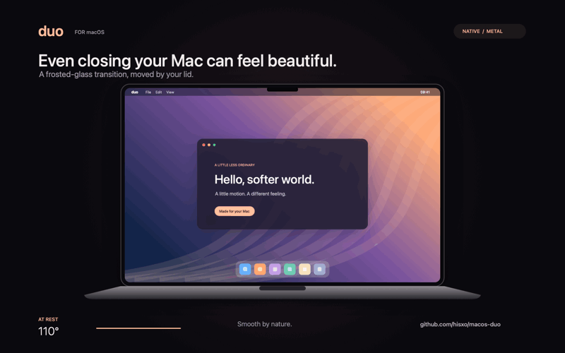

# MacOS Duo



[Watch or download the 60 fps video](docs/media/macos-duo.mp4) · Synthetic demo desktop, rendered with the app's Metal shader. No personal screen capture.

A native macOS menu-bar app that adapts the iPhone Duo's frosted-glass transition to the MacBook's physical lid movement. Built with SwiftUI, AppKit, Metal, and ScreenCaptureKit; no third-party runtime dependencies.

## Features

- Progressive blur and perspective driven by the physical hinge sensor.
- Two adjustable ranges: closing below 75°, and backward tilt beyond 120°. The backward range reaches its maximum at 165° with 65% intensity by default; set intensity to 0% to disable it.
- Gentle, refresh-rate-independent smoothing, gradual entry, and soft exit.
- Your actual desktop, with guided screen-access setup and automatic built-in display selection.
- English and French: automatic system-language detection and an immediate, persistent in-app override.
- Menu-bar controls, optional launch at login, Reduce Motion support, and Escape to dismiss.
- Reset restores animation defaults while preserving language, capture authorization, and launch-at-login preferences.

## Build and run

**[Download the ready-to-use app (Apple Silicon + Intel)](https://github.com/hisxo/macos-duo/releases/latest/download/MacOS-Duo-universal.zip)** — macOS 14 or newer. Unzip, drag **MacOS Duo.app** to Applications, and open it. No Xcode or compilation required.

This community build is ad-hoc signed and is **not notarized by Apple**. macOS may block the first launch; after attempting to open it, use **System Settings → Privacy & Security → Open Anyway** if you trust the download. Screen recording is authorized separately through the guided setup in the app.

For developers:

Requires macOS 14+, a Metal-capable Mac, and Xcode with its Metal compiler. Automatic animation requires a compatible Apple HID lid-angle sensor; the in-app preview works without one. Builds target the current architecture.

```sh
bash build.sh
open "build/MacOS Duo.app"
```

`bash build-release.sh` creates a universal app and a ZIP without extended attributes in `build/release/`. Compiler path mappings remove the local source directory from Swift build metadata. The release build uses the repository's neutral bundle identifier rather than a local override.

Drag the completed app to Applications to install it. Develop and test in `build/`; avoid rebuilding the installed/running copy while it holds capture authorization.

1. Click **Allow screen access / Autoriser l’écran**, then enable **MacOS Duo** in the Screen & System Audio Recording settings that open.
2. Return and click **Restart MacOS Duo / Redémarrer MacOS Duo**, unless macOS already restarted it. The exact same copy reopens and automatically verifies a screenshot. Once verified, the same button becomes **Test effect / Tester l’effet**.
3. Leave animation enabled and move the lid, or use the 5–180° preview slider.
4. Configure the backward range in the section below the main settings.
5. Select **System default**, **English**, or **Français** in the sidebar.

The menu bar provides desktop preview, dismissal, login-item settings, and Quit. Closing the window leaves the app running. Escape suppresses automatic animation until the lid returns to its neutral range.

## Privacy and permissions

The production app does not upload or save screen captures. A desktop snapshot is held in memory during the fold and released when its overlay closes. A separate screenshot explicitly captured for preview stays in memory until replaced or the app exits.

Without capture access, artwork remains available only in the in-app preview. Automatic desktop effects are skipped; capture errors never replace the desktop with artwork.

There is one setup route: request access → enable MacOS Duo in Settings → restart the same app → automatically verify capture. Only an explicit button click requests permission. See [Apple's screen-recording settings guide](https://support.apple.com/en-euro/guide/mac-help/mchld6aa7d23/mac).

The Restart button waits for this process to exit before opening the same bundle. Alternatively, quit with Command-Q and reopen it; closing its window does not quit the menu-bar app. A failed capture pauses automatic attempts and returns to guided setup. The app never repeatedly requests permission in a background loop or treats the Settings toggle alone as successful capture.

Persistent permissions belong to macOS. Builds are ad-hoc signed by default, so recompiling can invalidate an earlier grant. Quit the app, install the final build, and complete setup again. Avoid running different copies from Downloads, Applications, and build directories. If needed, remove/re-add the final app in macOS Settings or reset only its grant:

```sh
tccutil reset ScreenCapture io.macosduo.app
```

This does not grant permission automatically. Stable certificate signing is needed to preserve identity across builds. Public binary distribution should use Developer ID signing and notarization. `DUO_BUNDLE_ID` optionally overrides the bundle identifier for an existing local installation; never commit local identity configuration.

## Platform limits

- Sleep and secure lock screens are controlled by macOS. The app clears its overlay on sleep/lock and supports opening transitions in an unlocked session.
- Automatic effects select the built-in screen. External screens are unaffected by lid motion.
- This is a single-display adaptation, not Apple's private implementation. Viewing position, hardware geometry, capture latency, and refresh rate affect appearance. See [the animation study](ANIMATION_STUDY.md).
- Do not force a hinge beyond its physical range. The 180° preview is a simulation, not a statement of hardware capability.
- Native permission dialogs follow macOS language settings; the language override controls the app's interface and status messages.

## Validation

```sh
MTL_DEBUG_LAYER=1 "build/MacOS Duo.app/Contents/MacOS/MacOSDuo" --self-test
MTL_DEBUG_LAYER=1 "build/MacOS Duo.app/Contents/MacOS/MacOSDuo" --integration-test
"build/MacOS Duo.app/Contents/MacOS/MacOSDuo" --ui-test --test-language=fr
"build/MacOS Duo.app/Contents/MacOS/MacOSDuo" --ui-test --test-language=en
```

Tests cover regional language detection, manual override, translation completeness, both motion ranges, smoothing, reversible GPU output, 54 angle/frost edge cases, and resource release. Native tests exercise the artwork overlay, drawables, global Escape registration, late callbacks, capture cancellation, reset, and demo cleanup. Injected capture tests cover denied access without a capture request, grant verification, revocation, failure without automatic retry, and stale verification cancellation. They do not grant screen recording or physically move the lid. The native permission sheet still needs interactive validation on the target Mac.

Test output stays in ignored `build/validation/`. AppKit view snapshots omit the separate Metal surface. `Tools/VideoFrames.swift` extracts time-stamped frames from a supplied local video; keep those outputs outside the repository. No research videos, screenshots, logs, credentials, or compiled binaries are included in the source repository.

## Promotional animation

`docs/media/` contains a seamless 9-second showcase: an 800×500 GIF at 20 fps for embedding, a 1600×1000 H.264 MP4 at 60 fps for social posts, and a PNG cover. Use the MP4 for the smoothest result. These are original synthetic visuals, not a recording of a user's desktop. The laptop lid physically pivots around its hinge, closes onto the keyboard, and reopens; perspective and the app's actual Metal effect follow the same simulated angle.

Reproduce it with `bash Tools/build-promo.sh build/promo-new`. The output directory must not already contain an MP4; the tool refuses to overwrite previous exports. This uses native AppKit, Metal and AVFoundation, without third-party packages or screen-recording permission.

## Source layout

| File | Responsibility |
| --- | --- |
| `Sources/App.swift` | Settings window and menu bar |
| `Sources/Localization.swift` | Language detection and English/French strings |
| `Sources/DuoModel.swift` | Motion ranges, capture, settings, and lifecycle |
| `Sources/Renderer.swift` | GPU resources and Gaussian mip pyramid |
| `Sources/Fold.metal` | Projection, blur, haze, and extinction |
| `Sources/LidSensor.swift` | Nonexclusive HID feature-report reads |
| `Sources/EscapeKey.swift` | Temporary global Escape hotkey |

## Acknowledgements

HID identifiers and report layout are documented by [Sam Henri Gold's LidAngleSensor](https://github.com/samhenrigold/LidAngleSensor). Visual references are linked in the animation study. No Apple wallpapers, videos, phone models, or third-party application source are bundled. This independent project is unaffiliated with Apple.
